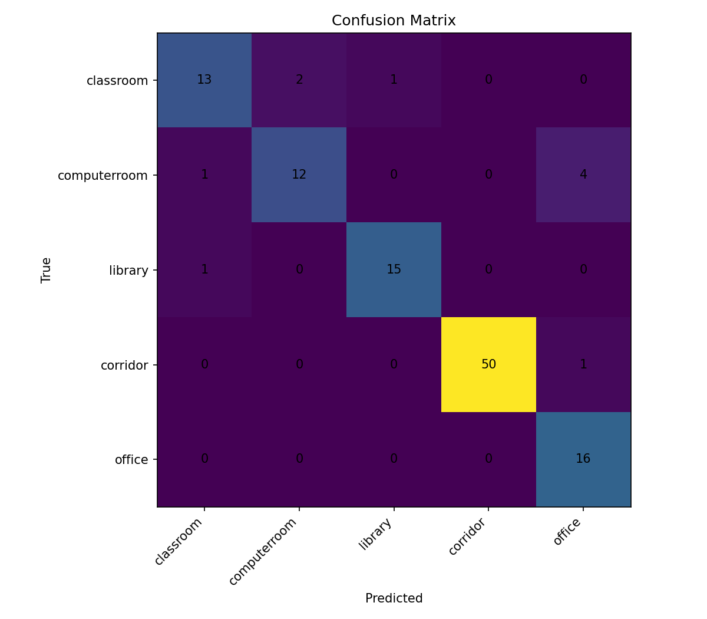
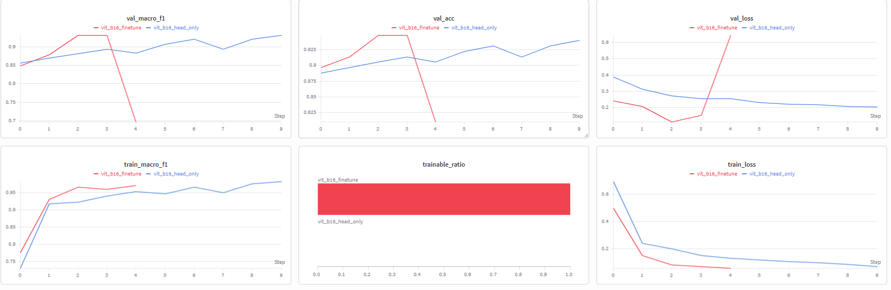

# CSC4005 Lab 5 Report – Vision Transformer for Smart Campus Scene Classification

## 1. Thông tin nhóm/cá nhân

- Họ tên: Trần Trường Giang - Nguyễn Văn Huy
- Mã sinh viên: 1671040009 - 1671040013
- Lớp: KHMT 16-01
- Link GitHub repo: https://github.com/FIT-DNU-CS-16-01/csc4005-lab5-khmt1601_nhom11
- Link W&B dashboard: https://wandb.ai/giangtit1007-dainam-vietnam/csc4005-lab6-mit-indoor-vit

## 2. Mô tả bài toán

Bài toán cần giải quyết là phân loại ảnh không gian trong nhà bằng Vision Transformer (ViT).  
Mô hình sẽ nhận ảnh đầu vào và dự đoán ảnh thuộc loại không gian nào trong môi trường trường học/thông minh (Smart Campus).  
Bài toán phù hợp với Smart Campus vì có thể ứng dụng vào quản lý không gian, camera thông minh, điều hướng và giám sát tự động trong trường học.  
Dataset sử dụng là MIT Indoor Scenes 67 và chọn ra 5 lớp gần với môi trường đại học.  
Các lớp cần phân loại gồm: classroom, computerroom, library, corridor, office.  
Mục tiêu là so sánh hiệu quả giữa cấu hình `head_only` và `finetune` của Vision Transformer.  

---

## 3. Dữ liệu

| Nội dung | Mô tả |
|---|---|
| Dataset gốc | MIT Indoor Scenes 67 |
| Subset sử dụng | classroom, computerroom, library, corridor, office |
| Số ảnh mỗi lớp | khoảng 150–200 ảnh/lớp |
| Train/Val/Test split | Train: 557 ảnh, Validation: 116 ảnh, Test: 116 ảnh |
| Tiền xử lý | resize 224×224, normalization, augmentation |

---

## 4. Mô hình ViT

Mô tả ngắn gọn kiến trúc:

```text
image → patch embedding → positional embedding → transformer encoder → classification head
```

Điền thông số:

| Thành phần | Giá trị |
|---|---|
| model_name | vit_b_16 |
| train_mode | head_only / finetune |
| img_size | 224 |
| batch size | 16 (head_only), 8 (finetune) |
| số epoch | 10 (head_only), 5 (finetune) |
| learning rate | 0.001 (head_only), 0.00005 (finetune) |
| optimizer | AdamW |
| total params | 85,802,501 |
| trainable params | 3,845 (head_only), 85,802,501 (finetune) |
| trainable ratio | 0.0000448 (head_only), 1.0 (finetune) |

---

## 5. Kết quả

| Metric | Validation | Test |
|---|---:|---:|
| Accuracy | 0.9397 | 0.9138 |
| Macro-F1 | 0.9321 | 0.8811 |
| Best epoch | 10 | 10 |

### Fine-tune

| Metric | Validation | Test |
|---|---:|---:|
| Accuracy | 0.9483 | 0.9569 |
| Macro-F1 | 0.9315 | 0.9434 |
| Best epoch | 3 | 3 |

### Chèn ảnh:




---

## 6. Phân tích lỗi

1. Lớp mô hình dự đoán tốt nhất là `corridor` và `office` do có đặc trưng hình ảnh rõ ràng và ít bị nhầm lẫn.  

2. Lớp dễ bị nhầm nhất là `computerroom` và `classroom`.  

3. Các cặp lớp dễ nhầm:
   - classroom ↔ computerroom
   - computerroom ↔ office
   
   Nguyên nhân là các lớp này đều chứa bàn ghế, máy tính, màn hình hoặc bố cục không gian tương tự nhau.  

4. Dữ liệu có hơi mất cân bằng, đặc biệt lớp `corridor` có số lượng dự đoán đúng vượt trội hơn các lớp khác.  

5. Augmentation giúp cải thiện khả năng tổng quát hóa và giảm overfitting trên tập validation.  

---

## 7. Liên hệ với lý thuyết ViT

1. Patch embedding trong ViT tương tự word embedding trong NLP.  

2. ViT cần positional embedding để biết vị trí của từng patch trong ảnh vì Transformer không tự hiểu thông tin không gian.  

3. `head_only` train nhanh hơn `finetune` vì chỉ cập nhật classification head thay vì toàn bộ backbone.  

4. Nên fine-tune toàn bộ backbone khi có dataset đủ lớn, tài nguyên mạnh và cần đạt hiệu năng cao hơn.  

---

## 8. W&B evidence

- Link run:
  - Head-only: https://wandb.ai/giangtit1007-dainam-vietnam/csc4005-lab6-mit-indoor-vit/runs/b1s4oqo0

- Screenshot dashboard:


- Các hyperparameter chính:
  - model_name = vit_b_16
  - img_size = 224
  - batch_size = 16 / 8
  - lr = 0.001 / 0.00005
  - dropout = 0.2
  - augment = true
  - optimizer = AdamW

- Các metric được log:
  - train_loss
  - val_loss
  - train_acc
  - val_acc
  - train_macro_f1
  - val_macro_f1
  - test_acc
  - test_macro_f1
  - epoch_time_sec

---

## 9. Kết luận

Mô hình Vision Transformer đạt kết quả tốt trên bài toán phân loại không gian trong nhà với dataset MIT Indoor Scenes 67.  
Cấu hình `head_only` cho learning curve ổn định, train nhanh và ít tốn tài nguyên hơn.  
Trong khi đó, `finetune` đạt kết quả test accuracy và macro-F1 cao hơn nhưng thời gian train lâu hơn và dễ overfitting hơn ở epoch cuối.  
ViT có ưu điểm là học được quan hệ toàn cục giữa các patch ảnh thông qua self-attention.  
Tuy nhiên với dataset nhỏ, ViT dễ overfitting nếu fine-tune toàn bộ backbone.  
Nếu cải thiện thêm, có thể tăng chất lượng dữ liệu, áp dụng augmentation mạnh hơn và tinh chỉnh learning rate phù hợp hơn.  
