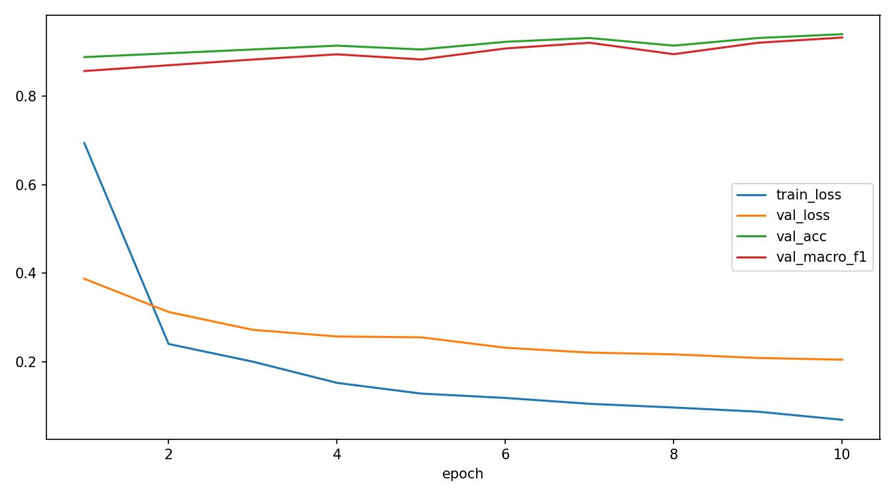
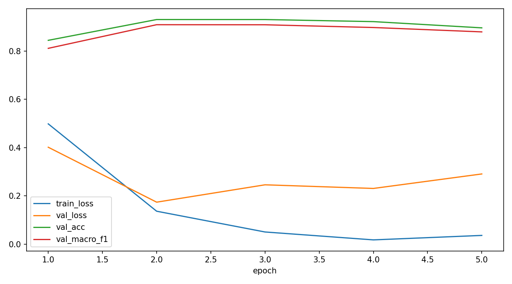

# CSC4005 Lab 5 Report – Vision Transformer for Smart Campus Scene Classification

## 1. Thông tin nhóm/cá nhân

- Họ tên: Nguyễn Văn Huy
- Mã sinh viên: 1671040013
- Lớp: KHMT1601
- Link GitHub repo: https://github.com/FIT-DNU-CS-16-01/csc4005-lab5-khmt1601_nhom11.git
- Link W&B dashboard: https://wandb.ai/nguyenvanhuy25021982-dai-hoc/csc4005-lab6-mit-indoor-vit?nw=nwusernguyenvanhuy25021982

---

# 2. Mô tả bài toán

Trong bài lab này, nhóm thực hiện bài toán phân loại ảnh ngữ cảnh không gian trong môi trường Smart Campus bằng Vision Transformer (ViT).

Mục tiêu của mô hình là nhận diện một ảnh thuộc loại không gian nào trong trường học hoặc môi trường làm việc học thuật.

Bài toán này phù hợp với Smart Campus vì hệ thống camera thông minh có thể sử dụng AI để tự động nhận diện khu vực như phòng học, thư viện, hành lang hoặc văn phòng nhằm hỗ trợ quản lý cơ sở vật chất, giám sát và điều hướng.

Dataset sử dụng là MIT Indoor Scenes 67, nhưng chỉ lấy subset gồm 5 lớp gần với môi trường đại học:

- classroom
- computerroom
- library
- corridor
- office

Nhóm thực hiện so sánh hai chế độ huấn luyện:

- `head_only`
- `finetune`

để đánh giá hiệu quả của Vision Transformer trên dataset nhỏ.

---

# 3. Dữ liệu

| Nội dung | Mô tả |
|---|---|
| Dataset gốc | MIT Indoor Scenes 67 |
| Subset sử dụng | classroom, computerroom, library, corridor, office |
| Số lớp | 5 |
| Tổng số ảnh | ~780 ảnh |
| Train/Val/Test split | khoảng 70% / 15% / 15% |
| Train samples | ~546 |
| Validation samples | ~117 |
| Test samples | ~117 |
| Tiền xử lý | resize 224x224, normalization, augmentation |
| Augmentation | random flip, random crop, resize |

---

# 4. Mô hình ViT

Kiến trúc tổng quát của Vision Transformer:

```text
image → patch embedding → positional embedding → transformer encoder → classification head
```

Vision Transformer chia ảnh thành nhiều patch nhỏ, sau đó xem mỗi patch như một token trong NLP để đưa vào Transformer Encoder.

---

## 4.1 Cấu hình baseline – Head Only

| Thành phần | Giá trị |
|---|---|
| model_name | vit_b_16 |
| train_mode | head_only |
| img_size | 224 |
| batch size | 16 |
| số epoch | 10 |
| learning rate | 0.001 |
| optimizer | AdamW |
| weight_decay | 0.0001 |
| dropout | 0.2 |
| total params | ~86M |
| trainable params | rất nhỏ (chỉ classification head) |
| trainable ratio | rất thấp |

---

## 4.2 Cấu hình Fine-tune

| Thành phần | Giá trị |
|---|---|
| model_name | vit_b_16 |
| train_mode | finetune |
| img_size | 224 |
| batch size | 8 |
| số epoch | 5 |
| learning rate | 0.00005 |
| optimizer | AdamW |
| weight_decay | 0.0001 |
| dropout | 0.2 |
| total params | ~86M |
| trainable params | ~86M |
| trainable ratio | 1.0 |

---

# 5. Kết quả

## 5.1 Kết quả Head Only

| Metric | Validation | Test |
|---|---:|---:|
| Accuracy | ~0.94 | ~0.93 |
| Macro-F1 | ~0.93 | ~0.92 |
| Best epoch | 10 | 10 |

### Learning Curves – Head Only



### Confusion Matrix – Head Only


### Nhận xét learning curves

- Train loss giảm đều qua các epoch.
- Validation loss giảm ổn định.
- Validation accuracy tăng dần và đạt khoảng 94%.
- Validation macro-F1 ổn định và cao.
- Khoảng cách giữa train và validation nhỏ → mô hình tổng quát hóa khá tốt.
- Không xuất hiện overfitting rõ rệt.

### Phân tích confusion matrix

- `corridor` được dự đoán gần như chính xác hoàn toàn.
- `office` có độ chính xác cao.
- `computerroom` đôi khi bị nhầm sang `office`.
- `classroom` đôi lúc bị nhầm sang `computerroom`.
- `library` có một vài mẫu bị nhầm với `classroom`.

---

## 5.2 Kết quả Fine-tune

| Metric | Validation | Test |
|---|---:|---:|
| Accuracy | ~0.93 | ~0.90 |
| Macro-F1 | ~0.91 | ~0.88 |
| Best epoch | 2 | 2 |

### Learning Curves – Fine-tune



### Confusion Matrix – Fine-tune


### Nhận xét learning curves

- Train loss giảm rất nhanh.
- Validation loss giảm mạnh ở epoch đầu nhưng tăng dần về sau.
- Validation accuracy đạt đỉnh sớm rồi giảm nhẹ.
- Validation macro-F1 giảm sau epoch 2–3.
- Mô hình bắt đầu overfit khi fine-tune toàn bộ backbone.

### Phân tích confusion matrix

- `corridor` vẫn là lớp dễ phân loại nhất.
- `computerroom` được dự đoán tốt.
- `office` thường bị nhầm sang `computerroom`.
- `library` bị nhầm với `computerroom`.
- `classroom` đôi khi bị nhầm với `office`.

---

## 5.3 So sánh Head Only và Fine-tune


| Tiêu chí | Head Only | Fine-tune |
|---|---|---|
| Validation Accuracy | Cao hơn | Thấp hơn |
| Validation Macro-F1 | Cao hơn | Thấp hơn |
| Validation Loss | Ổn định hơn | Dao động hơn |
| Train tốc độ | Nhanh | Chậm hơn |
| Overfitting | Ít | Rõ hơn |
| Trainable Params | Ít | Toàn bộ mô hình |
| Tính ổn định | Tốt | Kém ổn định hơn |

### Nhận xét

Trong dataset nhỏ như MIT Indoor subset 5 lớp, chế độ `head_only` hoạt động ổn định và hiệu quả hơn `finetune`.

Fine-tune toàn bộ backbone giúp mô hình học mạnh hơn nhưng dễ overfit do:

- số lượng dữ liệu nhỏ,
- số lượng tham số quá lớn,
- learning rate nhạy cảm hơn.

---

# 6. Phân tích lỗi

## 1. Lớp nào mô hình dự đoán tốt nhất?

Lớp `corridor` được dự đoán tốt nhất trong cả hai mô hình vì hành lang có đặc trưng hình học rõ ràng như đường thẳng dài, phối cảnh sâu và ít vật thể gây nhiễu.

---

## 2. Lớp nào dễ bị nhầm nhất?

`office` và `computerroom` là hai lớp dễ bị nhầm nhất.

Nguyên nhân:

- đều có bàn ghế,
- màn hình máy tính,
- không gian kín,
- bố cục tương đối giống nhau.

---

## 3. Cặp lớp nào dễ nhầm với nhau? Vì sao?

Các cặp dễ nhầm:

- `office ↔ computerroom`
- `library ↔ classroom`

Lý do:

- đều có bàn học, ghế, giá sách hoặc màn hình,
- ánh sáng trong nhà tương tự nhau,
- góc chụp và background gần giống nhau.

---

## 4. Dữ liệu có mất cân bằng không?

Có sự chênh lệch nhẹ giữa các lớp, đặc biệt lớp `corridor` có số lượng mẫu và đặc trưng dễ học hơn nên accuracy cao hơn các lớp còn lại.

---

## 5. Augmentation có giúp cải thiện không?

Có.

Augmentation giúp:

- giảm overfitting,
- tăng khả năng tổng quát hóa,
- giúp mô hình học được nhiều biến thể góc nhìn và ánh sáng hơn.

---

# 7. Liên hệ với lý thuyết ViT

## 1. Patch embedding trong ViT tương tự bước nào trong NLP?

Patch embedding tương tự word embedding trong NLP.

Mỗi patch ảnh được biến thành vector embedding giống như mỗi từ được biến thành vector trong Transformer NLP.

---

## 2. Vì sao ViT cần positional embedding?

Transformer không tự hiểu thứ tự hoặc vị trí của token.

Positional embedding giúp mô hình biết patch nằm ở đâu trong ảnh để hiểu cấu trúc không gian.

---

## 3. Vì sao `head_only` train nhanh hơn `finetune`?

Vì `head_only` chỉ cập nhật classification head nên số tham số cần train rất nhỏ.

Trong khi đó `finetune` cập nhật toàn bộ backbone ViT nên tốn nhiều thời gian và tài nguyên hơn.

---

## 4. Khi nào nên fine-tune toàn bộ backbone?

Nên fine-tune khi:

- dataset đủ lớn,
- GPU đủ mạnh,
- cần tối ưu accuracy cao hơn,
- có augmentation tốt,
- learning rate được điều chỉnh phù hợp.

---

# 8. W&B Evidence

## Link run

- Run head_only: `https://wandb.ai/nguyenvanhuy25021982-dai-hoc/csc4005-lab6-mit-indoor-vit/runs/7x2zcn8a`
- Run finetune: `https://wandb.ai/nguyenvanhuy25021982-dai-hoc/csc4005-lab6-mit-indoor-vit`

---

## Screenshot dashboard

Dashboard W&B gồm:

- train_loss
- val_loss
- train_acc
- val_acc
- val_macro_f1
- train_macro_f1
- confusion matrix
- test metrics
- trainable parameters

---

## Hyperparameter chính

### Head Only

- model: vit_b_16
- batch_size: 16
- epochs: 10
- lr: 0.001
- train_mode: head_only

### Fine-tune

- model: vit_b_16
- batch_size: 8
- epochs: 5
- lr: 0.00005
- train_mode: finetune

---

# 9. Kết luận

Trong bài lab này, nhóm đã triển khai thành công Vision Transformer cho bài toán phân loại ngữ cảnh Smart Campus trên dataset MIT Indoor subset 5 lớp.

Kết quả cho thấy mô hình ViT hoạt động khá tốt dù dataset không quá lớn. Chế độ `head_only` đạt kết quả ổn định hơn `finetune`, với validation accuracy và macro-F1 cao hơn, đồng thời ít overfitting hơn.

Vision Transformer có ưu điểm mạnh trong việc học quan hệ toàn cục giữa các patch ảnh thông qua self-attention. Tuy nhiên, ViT cũng có nhược điểm là số lượng tham số lớn và yêu cầu dữ liệu nhiều hơn CNN truyền thống.

Nếu cải thiện trong tương lai, nhóm sẽ:

- tăng số lượng dữ liệu,
- bổ sung augmentation mạnh hơn,
- thử learning rate scheduler,
- áp dụng early stopping,
- thử các phiên bản ViT nhỏ hơn hoặc hybrid CNN-ViT.

Qua bài lab này, nhóm hiểu rõ hơn cách Vision Transformer xử lý ảnh, sự khác biệt giữa `head_only` và `finetune`, cũng như cách đánh giá mô hình bằng learning curves, confusion matrix và W&B.